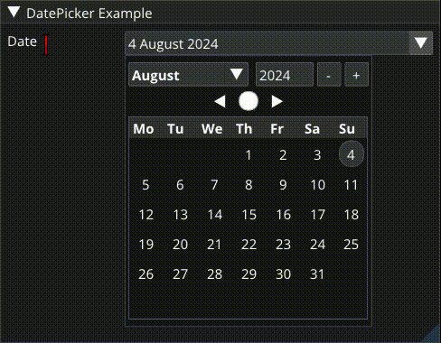
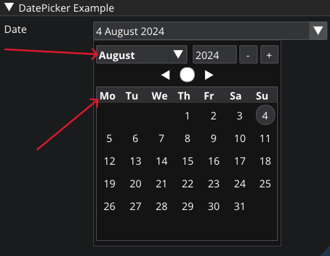

# ImGuiDatePicker
ImGuiDatePicker is a custom calendar-style date-picker widget for [Dear ImGui](https://github.com/ocornut/imgui) written in `C++20` that can easily be compiled alongside `ImGui` by adding the header and source files to your `ImGui` project.


Font used: [Open Sans](https://fonts.google.com/specimen/Open+Sans)

ImGuiDatePicker uses the `tm` struct for working with dates:
``` C++
struct tm
{
    int tm_sec;   // seconds after the minute - [0, 60] including leap second
    int tm_min;   // minutes after the hour - [0, 59]
    int tm_hour;  // hours since midnight - [0, 23]
    int tm_mday;  // day of the month - [1, 31]
    int tm_mon;   // months since January - [0, 11]
    int tm_year;  // years since 1900
    int tm_wday;  // days since Sunday - [0, 6]
    int tm_yday;  // days since January 1 - [0, 365]
    int tm_isdst; // daylight savings time flag
};
```
## Including
`IMGUI_DATEPICKER_YEAR_MIN` and `IMGUI_DATEPICKER_YEAR_MAX` should be defined before including [ImGuiDatePicker.hpp](ImGuiDatePicker.hpp). If they are not defined, they will default to `1900` and `3000` respectively.
``` C++
// Define the lowest year that the picker can select. In this example, '1970' is the Unix epoch.
#define IMGUI_DATEPICKER_YEAR_MIN 1970
// Define the highest year that the picker can select.
#define IMGUI_DATEPICKER_YEAR_MAX 3000
#include <ImGuiDatePicker.hpp>
```
## Usage
``` C++
// Get today's date and store it in a 'tm' struct named 't'
std::chrono::system_clock::time_point now = std::chrono::system_clock::now();
std::time_t currentTime = std::chrono::system_clock::to_time_t(now);
tm t = *std::gmtime(&currentTime);

// Use the picker
if (ImGui::DatePicker("Date", t))
{
    // Perform some event whenever the date 't' is changed
}
```
An `alt font` can also be supplied to the picker by calling `DatePickerEx`. This `alt font` will be used for the picker's days-of-the-week headers and for the month-picker combo box.
``` C++
ImFont* boldFont = GetBoldFontFromSomewhere();
tm t = GetTmFromSomewhere();
ImGui::DatePickerEx("Date", t, boldFont);
```


## License
ImGuiDatePicker is licensed under the MIT License. See [LICENSE](LICENSE).

```
MIT License

Copyright (c) 2024 Adam Foflonker

Permission is hereby granted, free of charge, to any person obtaining a copy
of this software and associated documentation files (the "Software"), to deal
in the Software without restriction, including without limitation the rights
to use, copy, modify, merge, publish, distribute, sublicense, and/or sell
copies of the Software, and to permit persons to whom the Software is
furnished to do so, subject to the following conditions:

The above copyright notice and this permission notice shall be included in all
copies or substantial portions of the Software.

THE SOFTWARE IS PROVIDED "AS IS", WITHOUT WARRANTY OF ANY KIND, EXPRESS OR
IMPLIED, INCLUDING BUT NOT LIMITED TO THE WARRANTIES OF MERCHANTABILITY,
FITNESS FOR A PARTICULAR PURPOSE AND NONINFRINGEMENT. IN NO EVENT SHALL THE
AUTHORS OR COPYRIGHT HOLDERS BE LIABLE FOR ANY CLAIM, DAMAGES OR OTHER
LIABILITY, WHETHER IN AN ACTION OF CONTRACT, TORT OR OTHERWISE, ARISING FROM,
OUT OF OR IN CONNECTION WITH THE SOFTWARE OR THE USE OR OTHER DEALINGS IN THE
SOFTWARE.
```
